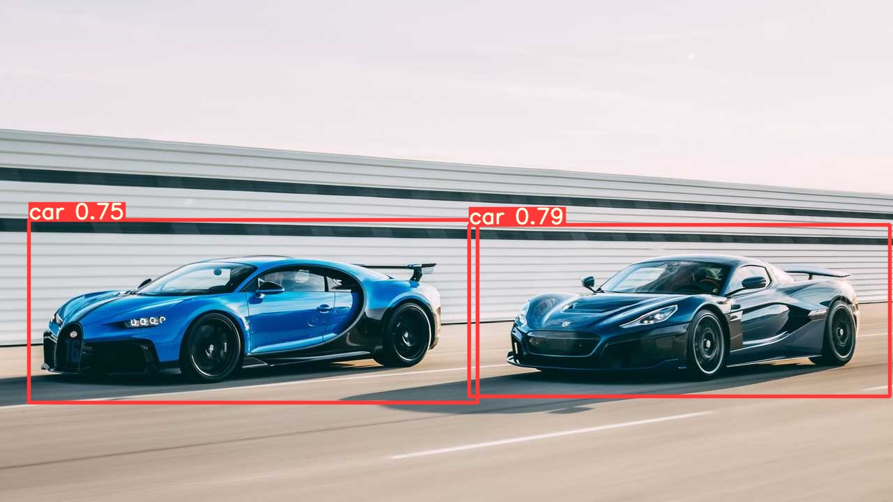
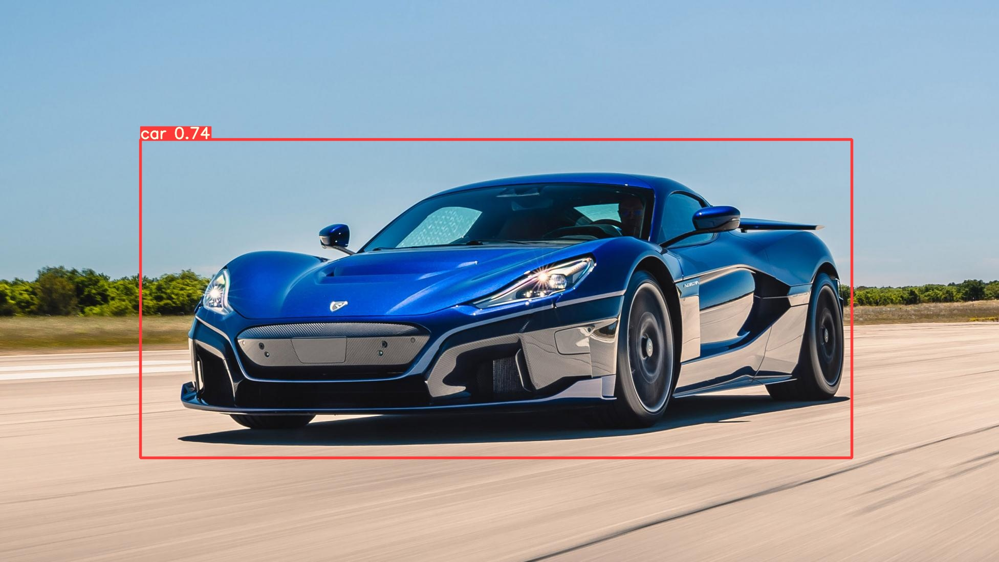

### YoloV5 Custom Object training

Colab notebook - [here](https://colab.research.google.com/drive/1CGXHcgIS9Gv7QXtFdgdHL13Wy3k4Vdg3?usp=sharing)

it is also available [here](./Custom_YOLOv5_Training_Tutorial.ipynb)

**Steps for training**

**Data preparation**
- You can refer customim.zip file for data preparation
- Download 30 images of two classes - 15 images for car and 15 images for flight
- You can go to this site https://www.makesense.ai/ and upload all images
- Now you can give the label names and then start annotation
- click Actions-->Export annotations

1) In colab notbook do the setup
2) Upload data(customim.zip)(avaliable in this repo)/ custom data to colab and place it in "datasets" folder. Make like below tree structure

```
# Tree structure
datasets 
        ---->customim
                        --->images
                                  -->train
                                          -->001.jpg
                                          -->002.jpg
                                          ...
                        --->labels
                                  -->train
                                          -->001.txt
                                          -->002.txt
                                          ...
```

3) Modify coco128.yaml file like below with path of custom dataset , number of classes and class names

**coco128.yaml**
```

# Train/val/test sets as 1) dir: path/to/imgs, 2) file: path/to/imgs.txt, or 3) list: [path/to/imgs1, path/to/imgs2, ..]
path: ../datasets/customim  # dataset root dir
train: images/train  # train images (relative to 'path') 128 images
val: images/train  # val images (relative to 'path') 128 images
test:  # test images (optional)

# Classes
nc: 2  # number of classes
names: [ 'car','flight' ]  # class names


```

4) you can run the cell to train for 200 epochs
5) Upload the [test images](./test.zip) or your own test images to colab
5) Now you can provide the path of weights and test images to detect.py 

```
!python detect.py --weights runs/train/exp5/weights/last.pt --img 640 --conf 0.25 --source test/
```

#### Results




